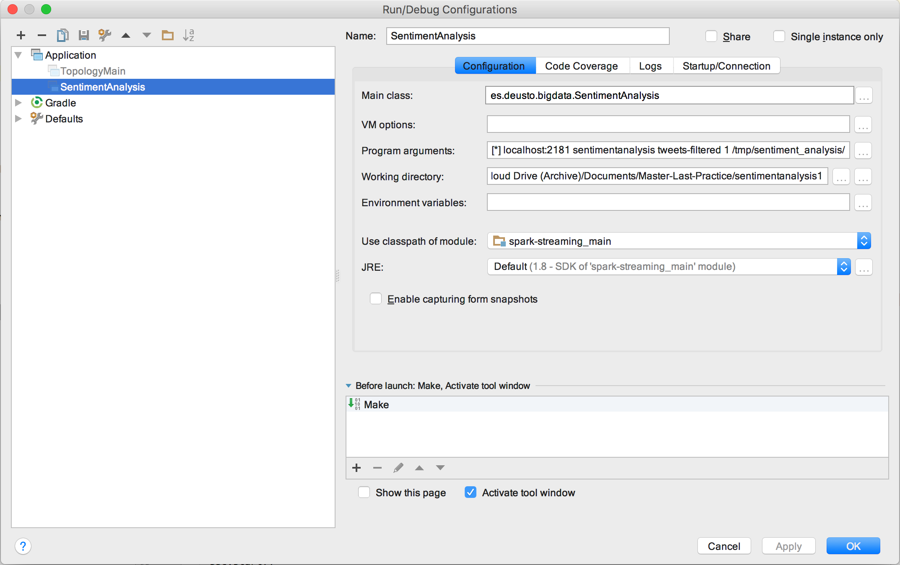
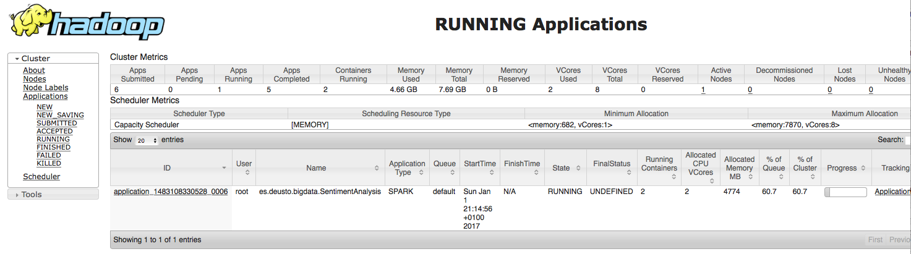

# Final Practice - Sentiment Analysis
***

## Index:
1. [Preparing the environment](#preparing)
2. [Preparing the Hortonworks Cluster](#cluster)
3. [Getting Tweets in Real Time](#REALTIME)
  3.1. [Create and setup your twitter account.](#TWITTERACCOUNT)
  3.2. [First Steps.](#STORM)
  3.3. [Deploying the Storm Topology in the Cluster.](#STORMDEPLOY)
4. [Batch Layer](#FLUME)
5. [Sentiment Analysis](#SPARK)
  5.1 [Deploying Spark Streaming Sentiment Analysis project in the clustere.](#SPARKDEPLOY)
6. [Miscellaneous.](#MISC)


---

### 1. Preparing the local environment <a name="preparing"></a>
This practice would use Hortonworks HDP2.4 image's stacks and versions. Allowing the students to run the sandbox image locally, in Azure, or deploying the cluster as seen in the first module.  

- Download the code from this repository:
```Bash
git clone https://github.com/KennethLobato/sentimentanalysis1.git
```
- All the code needed is included in this repository, nevertheless, there are some requirements that have to be installed in the machine:
  * Java SDK installed (version 1.7.x).
  * [Gradle. Last version.](https://gradle.org/)
  * [Scala. Version 2.10.](https://www.scala-lang.org/)
  * [IntelliJ. Last version.](https://www.jetbrains.com/idea/)

---
### 2. Preparing the Hortonworks cluster <a name="cluster"></a>
NOTE:
If you want to use the local sandbox using VirtualBox, please ensure that you download the proper version. In case you are working with Azure, connection should be done to the remote server IP Address instead of *localhost*:

1. Download the HDP2.4 Sandbox from here http://hortonworks.com/downloads/#sandbox

2. The archived versions (as current one is HDP2.5) can be found here:
    
3. Open the local address in a browser: http://127.0.0.1:8888.
4. Connect to the machine using SSH and change the ambari "admin" password, default for root is "hadoop", running the command *ambari-admin-password-reset* to change the default password for Ambari:
```Bash
$ ssh -p 2222 root@localhost
root@localhost\'s password:
You are required to change your password immediately (root enforced)
Last login: Sun Dec 11 12:54:24 2016 from 10.0.2.2
Changing password for root.
(current) UNIX password:
New password:
Retype new password:
\# ambari-admin-passwrod-reset
```
5. Once changed the admin password, login into your new sandbox opening http://127.0.0.1:8080 in a browser:

6. Start up (and clear the Maintenance from) until you get the following picture:

7. Modify in VirtualBox the image's open ports to allow connections from the local computer to the cluster image. The path should be: *right click over the image running -> Settings -> Network -> Adapter 1 -> Advanced -> Port Forwarding*. You would need the following connections (can be verified with a telnet to those ports):
  - Zookeeper, port 2181.
  - Kafka broker, port 6667.

8. Ensure you have in the /etc/hosts or c:\Windows\System32\drivers\etc\hosts the relation "127.0.0.1 sandbox.hortonworks.com"

---


### 3. Getting Tweets in Real Time. <a name="REALTIME"></a>

The purpose of this practice is to setup the following environment:


In the previous picture, the red boxes represent a Real Time Layer, while the green ones are for analytics (off-line). This is a common architecture, called Lambda, in which algorithms or analysis are performed over the data collected over the whole time (in batch or offline), while realtime applications are deployed in streams. Obviously Storm topology makes the ingestion of new data, but it also can perform filters, which could be improved using the Analytics layer (batch layer in Lambda architecture). Otherwise, in spark streaming box the algorithm for sentiment analysis is going to be performed for each message, and the model build there should be improved using the analytics layer.

Each tweet is going to be received by storm, sent to a kafka queue, and processed in real time using spark streaming, storing the final results in HDFS. This builds the real time layer.

On the other hand, flume is going to take all the messages sent to a Kafka topic and store them in an HDFS folder, where other applications like MapReduce, Pig, Hive, Impala, Spark, etc. could process them to analyse the whole information, improving the real-time layer or providing another opportunities.

#### 3.1. Create and setup your twitter account. <a name= "TWITTERACCOUNT"></a>
1. Create Twitter account if not having one already.
2. Generate the authentication tokens required to generate an OAuth:
  - Go to the following link: https://apps.twitter.com/
  - Click on Create New App.
  - Fullfil the required information (example data):
    + Name: DeustoPractice
    + Description: Desuto Practice
    + WebSite (for this purpose it's not needed, just input any well formed url): http://www.deusto.es
    + Callback URL: (blank)
    + Check the developer agreement
  - Click over *Create your Twitter application*
  - Go to the Keys and Access Tokens Tab.
  - Click on Regenerate Consumer Key and Secret
  - Click on Create my access token
3. Copy the following data to a text note named *twitter4j.properties* (it will be used later). An empty file could be found in the repository in *storm/src/main/resources/twitter4j.properties*:
```Bash
oauth.consumerKey=(...)
oauth.consumerSecret=(...)
oauth.accessToken=(...)
oauth.accessTokenSecret=(...)
```

#### 3.2. First Steps. <a name= "STORM"></a>
The first step of this practice is to collect tweets, filter them and transfer them to a Kafka queue, in real-time using Storm for that.

---
##### Create a Kafka Topic to receive the tweets.
1. To create a kafka topic, you should connect using SSH to the machine in which is running the HDP cluster.
2. As root, change to the proper directory */usr/hdp/current/kafka-broker*, create the topic named *tweets-filtered* and ensure that is created.

```Bash
[root@sandbox ~]\# cd /usr/hdp/current/kafka-broker
[root@sandbox kafka-broker]\# ./bin/kafka-topics.sh --zookeeper localhost:2181 --create --topic tweets-filtered --replication-factor 1 --partitions 4
Created topic "tweets-filtered".
[root@sandbox kafka-broker]\# ./bin/kafka-topics.sh --zookeeper localhost:2181 --list
tweets-filtered
```
Once created the topic, put a consumer to see if messages are being received on that topic. For that, use the following command:
```Bash
[root@sandbox kafka-broker]\# ./bin/kafka-console-consumer.sh --zookeeper localhost:2181 --topic tweets-filtered
{metadata.broker.list=sandbox.hortonworks.com:6667, request.timeout.ms=30000, client.id=console-consumer-34774, security.protocol=PLAINTEXT}
```
Last command will create a consumer for that topic that would print in your shell screen all the contents transferred to that topic. Once we start the topology, messages should be printed in this console.

---
##### Review of the Storm Topology.
The first step to continue is *Import the gradle project*. To do that, you have to launch IntelliJ and import the directory in which you have downloaded the repository. This is a gradle project, so it has to be selected in the *external model* window. In the next screen, as usual, select *Use Auto-Import*. When asked for modules/data to load, select all of them and click ok. You should get the following screen. All the project configuration is under *build.gradle*.


- Under storm/src/main/java/resources, there are two files *local-defaults.properties* and *twitter4j.properties*. The second one is the already created file, which as varies from each of your account, you should edit properly.
- The *local-defautls.properties* specifies the address where your cluster services are located, as well as the configuration of the Storm Topology parallelism.
- Taking a look to the topology expressed in that code:
  + StormRunner.java is a helper class with two methods that allows to run topologies locally or remotely.
  + TopologyMain.java is the entry point of this topology. After checking if the topology should be running locally or remotely (in a Storm cluster), it reads the information from the *local-defaults.properties* file, calling to a Factory where the *SentimentTopology* is created.
  + TopologyFactory.java is the proper place to setup and express the flow of the topology, which is quite straightforward in this case: a spout will connect using Twitter4j library to Tweeter, gathering tweets as messages. Those tweets are sent to a bolt called *TweetFilterBolt*, and the output of this Bolt will be sent to a Kafka Topic.

If your HDP cluster is running and the local-defaults.properties properly configured, you are ready to go and start debugging this topology. To debug locally, you can start the debugger from the file *TopologyMain.java*, as shown in the folling picture:


If it runs properly, you should start seeing text messages from tweets in your output window, and messages in json appearring in the kafka-console-consumer.

#### 3.3. Deploying the Storm Topology in the Cluster. <a name= "STORMDEPLOY"></a>
1. Compile the Storm Project.

2. Create a Shadow Jar, which will generate a jar file in *storm/build/libs/* named *storm-1.0-SNAPSHOT-all.jar*

3. Copy generated jar into HDP machine
```Bash
$ scp -P 2222 storm/build/libs/storm-1.0-SNAPSHOT-all.jar root@localhost:/root/
root@localhost\'s password:
storm-1.0-SNAPSHOT-all.jar                                                                                                           100%   24MB  49.8MB/s   00:00    

```
4. Login into your HDP.
5. Run the topology:
```Bash
[root@sandbox ~]\# storm jar storm-1.0-SNAPSHOT-all.jar es.deusto.bigdata.start.TopologyMain remote-topology
SLF4J: Class path contains multiple SLF4J bindings.
SLF4J: Found binding in [jar:file:/usr/hdp/2.4.0.0-169/storm/lib/log4j-slf4j-impl-2.1.jar!/org/slf4j/impl/StaticLoggerBinder.class]
SLF4J: Found binding in [jar:file:/root/storm-1.0-SNAPSHOT-all.jar!/org/slf4j/impl/StaticLoggerBinder.class]
SLF4J: See http://www.slf4j.org/codes.html#multiple_bindings for an explanation.
SLF4J: Actual binding is of type [org.apache.logging.slf4j.Log4jLoggerFactory]
Running: /usr/lib/jvm/java/bin/java -client -Ddaemon.name= -Dstorm.options= -Dstorm.home=/usr/hdp/2.4.0.0-169/storm -Dstorm.log.dir=/var/log/storm -Djava.library.path=/usr/local/lib:/opt/local/lib:/usr/lib:/usr/hdp/current/storm-client/lib -Dstorm.conf.file= -cp /usr/hdp/2.4.0.0-169/storm/lib/zookeeper.jar:/usr/hdp/2.4.0.0-169/storm/lib/java.classpath-0.2.2.jar:/usr/hdp/2.4.0.0-169/storm/lib/core.incubator-0.1.0.jar:/usr/hdp/2.4.0.0-169/storm/lib/tools.namespace-0.2.4.jar:/usr/hdp/2.4.0.0-169/storm/lib/ring-servlet-1.3.0.jar:/usr/hdp/2.4.0.0-169/storm/lib/oncrpc-1.0.7.jar:/usr/hdp/2.4.0.0-169/storm/lib/slf4j-api-1.7.7.jar:/usr/hdp/2.4.0.0-169/storm/lib/log4j-slf4j-impl-2.1.jar:/usr/hdp/2.4.0.0-169/storm/lib/ring-devel-1.3.0.jar:/usr/hdp/2.4.0.0-169/storm/lib/minlog-1.2.jar:/usr/hdp/2.4.0.0-169/storm/lib/log4j-core-2.1.jar:/usr/hdp/2.4.0.0-169/storm/lib/reflectasm-1.07-shaded.jar:/usr/hdp/2.4.0.0-169/storm/lib/javax.servlet-2.5.0.v201103041518.jar:/usr/hdp/2.4.0.0-169/storm/lib/clout-1.0.1.jar:/usr/hdp/2.4.0.0-169/storm/lib/disruptor-2.10.1.jar:/usr/hdp/2.4.0.0-169/storm/lib/hiccup-0.3.6.jar:/usr/hdp/2.4.0.0-169/storm/lib/tigris-0.1.1.jar:/usr/hdp/2.4.0.0-169/storm/lib/clj-time-0.8.0.jar:/usr/hdp/2.4.0.0-169/storm/lib/ns-tracker-0.2.2.jar:/usr/hdp/2.4.0.0-169/storm/lib/hadoop-auth-2.7.1.2.4.0.0-169.jar:/usr/hdp/2.4.0.0-169/storm/lib/ring-core-1.1.5.jar:/usr/hdp/2.4.0.0-169/storm/lib/gmetric4j-1.0.7.jar:/usr/hdp/2.4.0.0-169/storm/lib/kryo-2.21.jar:/usr/hdp/2.4.0.0-169/storm/lib/servlet-api-2.5.jar:/usr/hdp/2.4.0.0-169/storm/lib/compojure-1.1.3.jar:/usr/hdp/2.4.0.0-169/storm/lib/ring-json-0.3.1.jar:/usr/hdp/2.4.0.0-169/storm/lib/cheshire-5.3.1.jar:/usr/hdp/2.4.0.0-169/storm/lib/commons-codec-1.6.jar:/usr/hdp/2.4.0.0-169/storm/lib/storm-core-0.10.0.2.4.0.0-169.jar:/usr/hdp/2.4.0.0-169/storm/lib/jackson-core-2.3.1.jar:/usr/hdp/2.4.0.0-169/storm/lib/clojure-1.6.0.jar:/usr/hdp/2.4.0.0-169/storm/lib/jline-0.9.94.jar:/usr/hdp/2.4.0.0-169/storm/lib/asm-4.0.jar:/usr/hdp/2.4.0.0-169/storm/lib/jackson-dataformat-smile-2.3.1.jar:/usr/hdp/2.4.0.0-169/storm/lib/log4j-api-2.1.jar:/usr/hdp/2.4.0.0-169/storm/lib/clj-stacktrace-0.2.7.jar:/usr/hdp/2.4.0.0-169/storm/lib/ring-jetty-adapter-1.3.0.jar:/usr/hdp/2.4.0.0-169/storm/lib/log4j-over-slf4j-1.6.6.jar:/usr/hdp/2.4.0.0-169/storm/lib/tools.logging-0.2.3.jar:/usr/hdp/2.4.0.0-169/storm/lib/ambari-metrics-storm-sink.jar:storm-1.0-SNAPSHOT-all.jar:/usr/hdp/current/storm-supervisor/conf:/usr/hdp/2.4.0.0-169/storm/bin -Dstorm.jar=storm-1.0-SNAPSHOT-all.jar es.deusto.bigdata.start.TopologyMain remote-topology
SLF4J: Class path contains multiple SLF4J bindings.
SLF4J: Found binding in [jar:file:/usr/hdp/2.4.0.0-169/storm/lib/log4j-slf4j-impl-2.1.jar!/org/slf4j/impl/StaticLoggerBinder.class]
SLF4J: Found binding in [jar:file:/root/storm-1.0-SNAPSHOT-all.jar!/org/slf4j/impl/StaticLoggerBinder.class]
SLF4J: See http://www.slf4j.org/codes.html#multiple_bindings for an explanation.
SLF4J: Actual binding is of type [org.apache.logging.slf4j.Log4jLoggerFactory]
562  [main] INFO  b.s.u.Utils - Using defaults.yaml from resources
639  [main] INFO  b.s.u.Utils - Using storm.yaml from resources
691  [main] INFO  b.s.u.Utils - Using defaults.yaml from resources
715  [main] INFO  b.s.u.Utils - Using storm.yaml from resources
734  [main] INFO  b.s.StormSubmitter - Generated ZooKeeper secret payload for MD5-digest: -6313551064580831750:-6990361885434353760
738  [main] INFO  b.s.s.a.AuthUtils - Got AutoCreds []
764  [main] INFO  b.s.u.StormBoundedExponentialBackoffRetry - The baseSleepTimeMs [2000] the maxSleepTimeMs [60000] the maxRetries [5]
838  [main] INFO  b.s.u.StormBoundedExponentialBackoffRetry - The baseSleepTimeMs [2000] the maxSleepTimeMs [60000] the maxRetries [5]
838  [main] INFO  b.s.u.StormBoundedExponentialBackoffRetry - The baseSleepTimeMs [2000] the maxSleepTimeMs [60000] the maxRetries [5]
842  [main] INFO  b.s.u.StormBoundedExponentialBackoffRetry - The baseSleepTimeMs [2000] the maxSleepTimeMs [60000] the maxRetries [5]
847  [main] INFO  b.s.u.StormBoundedExponentialBackoffRetry - The baseSleepTimeMs [2000] the maxSleepTimeMs [60000] the maxRetries [5]
851  [main] INFO  b.s.u.StormBoundedExponentialBackoffRetry - The baseSleepTimeMs [2000] the maxSleepTimeMs [60000] the maxRetries [5]
922  [main] INFO  b.s.StormSubmitter - Uploading topology jar storm-1.0-SNAPSHOT-all.jar to assigned location: /hadoop/storm/nimbus/inbox/stormjar-0765605c-f839-4a08-b5eb-a9c98b6bc3cb.jar
1257 [main] INFO  b.s.StormSubmitter - Successfully uploaded topology jar to assigned location: /hadoop/storm/nimbus/inbox/stormjar-0765605c-f839-4a08-b5eb-a9c98b6bc3cb.jar
1257 [main] INFO  b.s.StormSubmitter - Submitting topology tweet-ingestion in distributed mode with conf {"storm.zookeeper.topology.auth.scheme":"digest","storm.zookeeper.topology.auth.payload":"-6313551064580831750:-6990361885434353760","topology.workers":1,"storm.zookeeper.port":2181,"topology.debug":false,"storm.zookeeper.servers":["localhost"],"kafka.broker.properties":{"Zookeeper.Servers":"localhost","key.serializer":"kafka.serializer.DefaultEncoder","partitioner.class":"kafka.producer.DefaultPartitioner","message.send.max.retries":"3","Storm.KafkaSinkBolt.NumberOfTasks":"1","Storm.TopologyWorkers":"1","metadata.broker.list":"localhost:6667","request.required.acks":"1","topic.metadata.refresh.interval.ms":"600000","Storm.TwitterSpout.NumberOfTasks":"1","Storm.TwitterSpout.Parallelism":"1","Storm.FilterTweets.Parallelism":"1","compresion.codec":"none","Storm.FilterTweets.NumberOfTasks":"1","bootstrap.servers":"localhost:6667","metadata.fetch.timeout.ms":"1000","client.id":"storm-processor","Zookeeper.Port":"2181","Kafka.Topic.TweetsFiltered":"tweets-filtered","Storm.KafkaSinkBolt.Parallelism":"1","producer.type":"sync","Storm.TopologyDebug":"false","value.serializer":"kafka.serializer.DefaultEncoder"}}
1974 [main] INFO  b.s.StormSubmitter - Finished submitting topology: tweet-ingestion
```

Once launched you should see the follwoing evidences:
  + If you have a kafka-console-consumer you should see messages entering the topic.
  + If you make a *hdfs dfs -ls /tmp/kafka/tweets-filtered/Y-M-D* you could see how the Flume process is introducing the messages there.
  + You have access to the Storm Interface on Ambari Web. Select *Storm->Quick Links* and open *Storm UI*. You have access to the "tweet-ingestion" topology, where you can *Deactivate* or *kill* it.
  

### 4. Batch Layer. <a name= "FLUME"></a>
##### Flume Configuration.
If last step was achieved successfully, messages are sent to a kafka topic, where several consumers could read them. Right now, there is one consumer already running, the one that uses the kafka-console-consumer that is running in a shell. We are going to create a flume agent to dump each message into the HDFS file system:
- Go to the ambari main web page (http://localhost:8080, if running locally in a VirtualBox) and click in Flume.
- Click on *Configs*.
- Open the file *flume-config/flume.conf* with a text reader and copy the contents.
- Paste the contents into the flume.conf in the Ambari webpage.

- Save the configuration.
- Restart the services.
- You should see the following agent running.


- Verify that once you run the topology, messages are being stored in the HDFS (e.g.):
```Bash
[root@sandbox kafka-broker]\# hdfs dfs -ls /tmp/kafka/tweets-filtered/16-12-28
(...)
-rw-r--r--   3 flume hdfs     222206 2016-12-28 16:50 /tmp/kafka/tweets-filtered/16-12-28/FlumeData.1482943819325
-rw-r--r--   3 flume hdfs      78173 2016-12-28 16:50 /tmp/kafka/tweets-filtered/16-12-28/FlumeData.1482943828812
-rw-r--r--   3 flume hdfs       3040 2016-12-28 16:50 /tmp/kafka/tweets-filtered/16-12-28/FlumeData.1482943828813
(...)
```
##### Spark Zeppelin Analysis.
To start the analysis of the information that has been collected until this moment, we could use Spark with the help of Zeppelin Notebook. To start the process:
- Ensure that Zeppelin is running in the Ambari Web page (http://localhost:8080). If not, start properly the service.
- Connect to Zeppelin web page: http://localhost:9995
- Create a new note.
- In the First Paragraph verify that the SparkContext is created:
```scala
> sc
res0: org.apache.spark.SparkContext = org.apache.spark.SparkContext@1eccad33
```
- Load the files stored in the HDFS in the path */tmp/kafka/tweets-filtered/Y-M-D/*. NOTE: Remember to adapt sentences to your dates:
```scala
> val df = sqlContext.read.json("/tmp/kafka/tweets-filtered/16-12-28")
```
- Perform basic operations to view some results and count the number of tweets captured:
```scala
> df.count()
res7: Long = 503
> df.show()
+---------------+--------------------+--------------------+---------------------+-------------+-----------+--------------------+------------------+-------------------+-----------------+---------------+-----------+-------------------+-----------+-----------+----+--------------------+-----+--------------------+------------------+------------+--------------------+--------------------+--------------+--------------------+--------------------+--------------------+--------------------+
|contributorsIDs|           createdAt|currentUserRetweetId|extendedMediaEntities|favoriteCount|geoLocation|     hashtagEntities|                id|inReplyToScreenName|inReplyToStatusId|inReplyToUserId|isFavorited|isPossiblySensitive|isRetweeted|isTruncated|lang|       mediaEntities|place|        quotedStatus|    quotedStatusId|retweetCount|     retweetedStatus|              source|symbolEntities|                text|         urlEntities|                user| userMentionEntities|
+---------------+--------------------+--------------------+---------------------+-------------+-----------+--------------------+------------------+-------------------+-----------------+---------------+-----------+-------------------+-----------+-----------+----+--------------------+-----+--------------------+------------------+------------+--------------------+--------------------+--------------+--------------------+--------------------+--------------------+--------------------+
|             []|Dec 28, 2016 5:50...|                  -1|                   []|            0|       null|                  []|814151475689639937|               null|               -1|             -1|      false|              false|      false|      false|  es|                  []| null|                null|                -1|           0|                null|<a href="http://t...|            []|No hay nada más a...|                  []|[Sep 13, 2011 12:...|                  []|
|             []|Dec 28, 2016 5:50...|                  -1|                   []|            0|       null|[[21,5,TeamSuperJ...|814151475672674304|               null|               -1|             -1|      false|              false|      false|      false|  es|                  []| null|                null|                -1|           0|                null|<a href="https://...|            []|62 x #TeamSuperJu...|                  []|[Jan 19, 2016 9:3...|                  []|
|             []|Dec 28, 2016 5:50...|                  -1|                   []|            0|       null|[[21,5,TeamSuperJ...|814151475681107969|               null|               -1|             -1|      false|              false|      false|      false|  es|                  []| null|                null|                -1|           0|                null|<a href="https://...|            []|62 x #TeamSuperJu...|                  []|[Jan 23, 2016 9:4...|                  []|
(...)
```
- Extract the schema. It's important to understand the data before doing any analysis, this can be found in https://dev.twitter.com/overview/api/tweets. In that page they explain each of the fields and their meaning.
```scala
> df.printSchema()
root
 |-- contributorsIDs: array (nullable = true)
 |    |-- element: string (containsNull = true)
 |-- createdAt: string (nullable = true)
 |-- currentUserRetweetId: long (nullable = true)
(...)
```

After achieving this point, next step is to extract any valuable information, some examples:
```scala
> df.select( df("createdAt"),
    df("id"),
    df("geoLocation"),
    df("lang"),
    df("hashtagEntities.text") as "hashtag",
    df("user.id") as "userid",
    df("user.name") as "username",
    df("user.screenName") as "userscreenname",
    df("user.location") as "userlocation"
    ).show()
    +--------------------+------------------+-----------+----+--------------------+------------------+--------------------+---------------+--------------------+
    |           createdAt|                id|geoLocation|lang|             hashtag|            userid|            username| userscreenname|        userlocation|
    +--------------------+------------------+-----------+----+--------------------+------------------+--------------------+---------------+--------------------+
    |Dec 28, 2016 5:50...|814151475689639937|       null|  es|                  []|         372745491|              Silvia|       Silwiia_|  Burgos ~ Ciadoncha|
    |Dec 28, 2016 5:50...|814151475672674304|       null|  es|   [TeamSuperJunior]|        4782120752|         sjtamtam257|    sjtamtam257|                null|
    |Dec 28, 2016 5:50...|814151475681107969|       null|  es|   [TeamSuperJunior]|        4802101016|         sjtamtam297|    sjtamtam297|                null|
    |Dec 28, 2016 5:50...|814151475660079104|       null|  es|   [TeamSuperJunior]|        4761522294|         sjtamtam232|    sjtamtam232|                null|
    |Dec 28, 2016 5:50...|814151475681107968|       null|  es|   [TeamSuperJunior]|        4766833459|         sjtamtam237|    sjtamtam237|                null|
    |Dec 28, 2016 5:50...|814151475693846530|       null|  es|                  []|         957685932|      SANDRAPEREZCTO| CTOSANDRAPEREZ|     BOGOTA COLOMBIA|
    |Dec 28, 2016 5:50...|814151475689504769|       null|  es|   [TeamSuperJunior]|        4741733467|         sjtamtam209|    sjtamtam209|                null|
    |Dec 28, 2016 5:50...|814151475681054720|       null|  es|                  []|719267758064607232|          Karla Diaz|karla_diaz63sdh|San Luis Río Colo...|
    |Dec 28, 2016 5:50...|814151479892316160|       null|  es|                  []|         141382891|            Nachoo ☮|LOQUITO_x_BODIS|               Chile|
    |Dec 28, 2016 5:50...|814151479892332549|       null|  es|[Agronos, Solucio...|        3656170217|   Drones a la Vista| dronesalavista|      Madrid, España|
    (...)
```

```scala
val summaryDF = df.select( df("createdAt"),
    df("id"),
    df("geoLocation"),
    df("lang"),
    df("hashtagEntities.text") as "hashtag",
    df("user.id") as "userid",
    df("user.name") as "username",
    df("user.screenName") as "userscreenname",
    df("user.location") as "userlocation",
    df("text")
)
summaryDF.registerTempTable("summaryTempTable")
```


### 5. Sentiment Analysis. <a name="SPARK"></a>
In the repository, there is another folder that contains a Spark Streaming application. Most interesting facts for this application are:
- It's everything in one scala file: SentimentAnalysis.scala. It's quite simple and self explanatory.
- The main function receives 5 arguments, which have to be supplied if you want to debug locally from the Intellij. Those areguments are:
  + Launching mode: *local[\*]* or *yarn-cluster*
  + Zookeper Addresses, split by commas if using a cluster: localhost:2181
  + Kafka Consumer Group Name, e.g.: sentimentanalysis
  + Kafka Topic to consume: tweets-filtered
  + NumThreads to use per executor, e.g.: 1
  + HDFS Store Path, e.g.: /tmp/sentiment_analysis/
- If you want to debug locally, you have to run the Storm Topology to send tweets into the Kafka Queue, and setup properly previously shown arguments. *Run->Edit Configurations->Application->SentimentAnalysis->Program Arguments*

- Once fulfilled those arguments properly, you can launch the Spark Streaming application from the IntelliJ.

The model used to provide the sentiment analysis is **Stanford CoreNLP**. There are other alternatives as will be shown in Misc section, but this framework is well-known in the NLP field (Natural Language Processing). The only disadvantage is that it doesn't support sentiment analysis for Spanish, so in the Storm Filter Bolt it has been selected just to ingest "en" messages. More information about this library in the following links:
+ [Stanford CoreNLP Main Page](http://stanfordnlp.github.io/CoreNLP/)
+ [CoreNLP Features and supported languages](http://stanfordnlp.github.io/CoreNLP/human-languages.html)
+ [Sentiment Analysis official information](http://nlp.stanford.edu/sentiment/index.html)
+ [Sentiment Analysis Code](https://github.com/shekhargulati/52-technologies-in-2016/blob/master/03-stanford-corenlp/README.md)

#### 5.1. Deploying Spark Streaming Sentiment Analysis project in the clustere. <a name="SPARKDEPLOY"></a>
1. Compile the Spark Streaming project.

2. Make a shadow jar with the project.

3. Copy the generated jar to the HDP machine:
```Bash
scp -P 2222 spark-streaming/build/libs/spark-streaming-1.0-SNAPSHOT-all.jar root@localhost:/root/
root@localhost\'s password:
spark-streaming-1.0-SNAPSHOT-all.jar                                                                                                 100%  348MB  46.4MB/s   00:07                                                                                                100%  508MB  36.3MB/s   00:13
```
4. Login into Ambari Web.
5. Upload the amount of memory per container in Yarn.

6. SSH Login into the HDP machine.
7. Run the spark streaming project:
```Bash
$spark-submit --master yarn --deploy-mode cluster --executor-cores 4 --driver-memory 1g --executor-memory 2g --num-executors 2 --class es.deusto.bigdata.SentimentAnalysis spark-streaming-1.0-SNAPSHOT-all.jar yarn-cluster sandbox.hortonworks.com:2181 sentimentanalysis tweets-filtered 1 /tmp/sentiment_analysis/
```
8. Open the Resource Manager in Yarn. *Ambari Web -> Yarn -> Quick Links -> ResourceManager UI*

9. Monitor the spark job. It should be running (in my case I killed the zeppelin app to ensure enough resources). *ApplicationMaster Link in the running process on YARN ResourceManager UI*

10. Verify the ingestion in real time. *Streaming tab in the Application Manager of Spark*. There you have the latencies per microbatch, time to process, some estimations. This is the main source to optimize any Spark in real time.


### 6. Miscellaneous. <a name="MISC"></a>
There are some interesting links/projects that go further with the sentiment analysis. It's interesting to take an overview of the following projects:
- https://www.mapr.com/blog/spark-streaming-and-twitter-sentiment-analysis. This blogs explains the use the Stanford CoreNLP in Spark Streaming.
- https://devpost.com/software/spark-mllib-twitter-sentiment-analysis. The most complete project with source code I found. It makes a full solution with visualisation using D3.js, based on Stanford CoreNLP and MLLIB. The author creates a docker image to provide a distribution framework. MLLIB is used to train a Naïve Bayes classifier with a DataSet obtained from Sentiment140 website, and it's results are compared with CoreNLP. It's considered as a recommended reading if you want more knowledge about Sentiment Analysis. Source code is available [here](https://github.com/P7h/Spark-MLlib-Twitter-Sentiment-Analysis).
